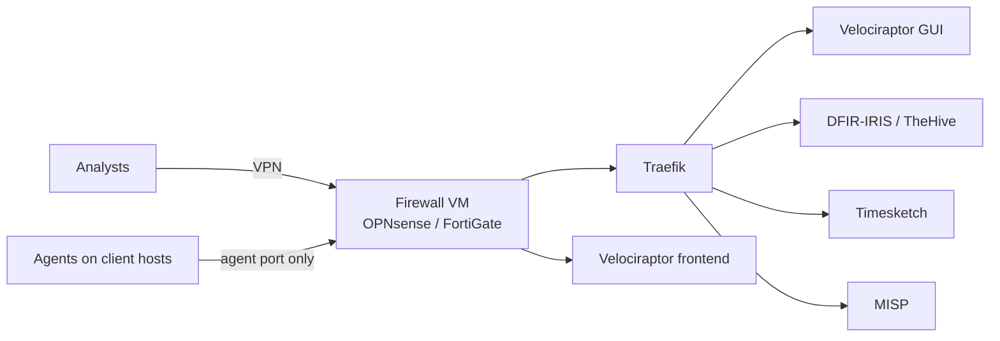

In [Part 1](/posts/dair-prepare-the-analyst-toolkit/), I covered the analyst's own toolkit, and in [Part 2](/posts/dair-prepare-logs-and-visibility/) the logs that need to exist before an incident. Both assume one person at one workstation. As soon as an incident involves several analysts or dozens of hosts, that stops working: evidence ends up scattered across laptops, IOCs live in someone's notes, and nobody has the full picture.

This post covers the **shared infrastructure** I keep ready for that situation. Six building blocks:

| Role | Tool |
|---|---|
| Firewall, VPN, segmentation | **OPNsense** or **FortiGate** VM |
| Web exposure | **Traefik** (reverse proxy), behind the VPN |
| Remote collection | **Velociraptor** server |
| Case management | **DFIR-IRIS** or **TheHive** |
| Shared timeline | **Plaso + Timesketch** |
| Threat intelligence | **MISP** |

Personally, I run a similar infrastructure in the cloud. That way it's always available, whatever the state of the client's network, and it's hosted in a sovereign EU cloud, so investigation data stays in Europe.

The key word, as in the rest of the Prepare step, is *before*. Building this during an incident costs hours you don't have.

---

## 1. Access: firewall, VPN, then a reverse proxy

These platforms hold the most sensitive data of an investigation: evidence, credentials found on compromised hosts, IOCs, notes about the client. None of their web interfaces should be reachable from the internet.

My design rule is simple:

- **A firewall VM sits in front of everything.** [OPNsense](https://docs.opnsense.org/) (open source) or a [FortiGate VM](https://docs.fortinet.com/product/fortigate-private-cloud) handles the firewall rules, terminates the VPN and segments the infrastructure.
- **Analysts reach everything through the VPN.** No VPN, no access to any interface.
- **Behind the VPN, a reverse proxy publishes the web interfaces.** I use [Traefik](https://doc.traefik.io/traefik/): one entry point, one hostname per tool, TLS everywhere.
- **Only one thing is exposed outside the VPN: the port Velociraptor agents connect to.** Compromised hosts can't join your VPN, so the agents need a direct path. The firewall forwards that single port to the Velociraptor frontend, nothing else (more on this below).



### Segmentation

The firewall isn't only a door; it also separates the zones behind it. A layout that works:

| Zone | Contains | Reachable from |
|---|---|---|
| VPN | Analyst laptops | Internet, authenticated VPN only |
| Exposure | Velociraptor frontend | Internet, agent port only |
| Tools | Traefik and the web platforms | VPN zone, through Traefik only |

The point is to limit the damage if one piece is compromised. The Velociraptor frontend faces the internet and talks to hosts you know are compromised: if it's ever abused, it shouldn't give direct access to the case database or the other tools. Log the firewall itself too, and send those logs off the box.

Which one? OPNsense is free and open source, and covers WireGuard, OpenVPN and IPsec. A FortiGate VM makes sense if your team already knows FortiOS or the client environments you work in are Fortinet-based; note that its free permanent trial license is limited in features and capacity, so plan for a real license in production.

Why a reverse proxy rather than opening each tool on its own port?

- **One place to manage TLS.** Traefik can request and renew certificates automatically. With the ACME DNS challenge, this works even for hostnames that are never reachable from the internet.
- **One place to add controls.** Middlewares let you restrict sources (the [IP allowlist](https://doc.traefik.io/traefik/reference/routing-configuration/http/middlewares/ipallowlist/) can be limited to the VPN range), add authentication or security headers, for every tool at once.
- **Less surface.** The tools listen only on an internal network; only the proxy is reachable from the VPN zone.

With Docker, a tool is published by a few labels. A minimal example restricting a service to the VPN range:

```yaml
labels:
  - "traefik.enable=true"
  - "traefik.http.routers.timesketch.rule=Host(`timesketch.ir.example.internal`)"
  - "traefik.http.routers.timesketch.tls=true"
  - "traefik.http.routers.timesketch.middlewares=vpn-only"
  # 10.8.0.0/24 is an example VPN range: adapt it to yours
  - "traefik.http.middlewares.vpn-only.ipallowlist.sourcerange=10.8.0.0/24"
```

On top of that: **MFA or SSO** on every tool that supports it, separate admin accounts, and backups of the platforms themselves. A case database that disappears in the middle of an incident is its own incident.

---

## 2. Remote collection: Velociraptor

In Part 1, [Velociraptor](https://docs.velociraptor.app/) appeared as a collection tool. Here it's the **server**: once an agent runs on a host, you can collect artefacts, hunt across the whole fleet with VQL queries, and pull files, all from one interface. On an incident with fifty suspicious hosts, that's the difference between days of manual collection and a few hours.

Velociraptor separates two things, and that's what makes the design above work:

- **The frontend**, which agents connect to. Agent traffic is encrypted twice (a session key inside TLS), and agents always verify the server certificate against the deployment's internal CA, which in self-signed mode pins the server certificate in the client.
- **The GUI**, which analysts use. In a self-signed deployment it listens on its own port (8889 by default), bound to localhost. The [Velociraptor documentation](https://docs.velociraptor.app/docs/deployment/security/) recommends restricting access to the GUI port while letting clients connect freely to the frontend port.

So in practice:

- The **frontend port** is the only port published outside the VPN. You choose it: many teams use 443 because it gets through most outbound filtering on client networks. Because agents pin the server certificate, this traffic shouldn't be TLS-terminated by the reverse proxy: expose it directly, or pass it through untouched.
- The **GUI** is published through Traefik, behind the VPN, like the other tools.

> If you deploy with Let's Encrypt certificates, Velociraptor serves the GUI and the frontend on the **same port**, so the GUI becomes reachable from wherever agents are. With the split design above, prefer the self-signed mode with separate ports.
{: .prompt-warning }

Things to prepare in advance:

- **Agent packages** for Windows (MSI) and Linux, already built with the right server address, so you can hand them to the client's IT team in the first hour.
- **A deployment method per environment**: GPO, SCCM/Intune, an existing EDR or a script. Ask the client which one they can use, early.
- **Separation between cases.** Velociraptor supports several organisations on one server; at a minimum, don't mix two clients' data in the same org.
- **Cleanup**: a documented way to uninstall agents at the end of the engagement.

---

## 3. Case management: DFIR-IRIS or TheHive

Without a case management platform, an investigation lives in shared spreadsheets, chat threads and individual notes. That works for one analyst over two days. It breaks down with a team over three weeks, and it makes the final report painful.

A case platform gives everyone the same view of:

- **Assets**: which hosts and accounts are involved, and their status (suspected, confirmed, cleaned).
- **IOCs**: hashes, IPs, domains, with their source and the cases they appear in.
- **Timeline**: the key events of the investigation, as they're confirmed.
- **Tasks**: who does what, and what's left.
- **Evidence**: what was collected, when and by whom, with hashes for the chain of custody.
- **Notes and reports**: the material the final report is built from.

Two options:

- **[DFIR-IRIS](https://docs.dfir-iris.org/)**: open source (LGPL-3.0), built by incident responders for incident responders. It covers everything in the list above, and its modules add IOC enrichment from **MISP** and VirusTotal, plus webhooks to connect other tools. It runs as a handful of Docker containers.
- **[TheHive](https://docs.strangebee.com/thehive/)**: maintained by StrangeBee, often paired with Cortex for automated analysis. Since version 5 it's no longer open source; there's a free **Community** license, with paid tiers for more users, organisations and features. Check the [license terms](https://docs.strangebee.com/thehive/installation/licenses/about-licenses/) against the size of your team before choosing it.

Whichever you pick, prepare **case templates**: the standard tasks of an investigation (collection, triage, scoping, containment, communication…) created automatically with each new case. When the call comes in, you open a case and the checklist is already there.

---

## 4. Shared timeline: Plaso and Timesketch

In Part 1, Plaso and Timesketch ran in a VM on the analyst workstation. On a team engagement, **Timesketch belongs on the shared infrastructure**: everyone searches the same timeline, tags events, adds comments, and saves searches the others can reuse.

The flow:

1. **Collect** artefacts with Velociraptor (or KAPE/UAC for offline hosts).
2. **Parse** them with [Plaso](https://plaso.readthedocs.io/) into a `.plaso` storage file. This is the heavy part: run it on a machine with enough CPU and disk, not on the Timesketch server itself if you can avoid it.
3. **Import** the result into [Timesketch](https://timesketch.org/), either through the web interface or with the `timesketch_importer` command-line tool, which splits large files before uploading. CSV and JSONL timelines from other tools can be imported too.
4. **Investigate together** in one *sketch* per case, combining timelines from several hosts.

Plan the storage: Timesketch runs on OpenSearch, and a few dozen hosts' worth of super timelines quickly adds up to hundreds of millions of events. Size the disk and memory for your largest expected case, not your average one.

---

## 5. Threat intelligence: MISP

[MISP](https://www.misp-project.org/) is the open-source platform for storing, correlating and sharing threat intelligence. In an investigation it answers two questions quickly: *have we seen this indicator before?* and *what do others know about it?*

What it brings to the incident response infrastructure:

- **Memory across cases.** Every IOC from a closed case stays searchable. When a hash or a domain shows up again months later, MISP's correlation links the two cases.
- **Feeds and sharing communities.** MISP can pull public feeds and synchronise with the communities you belong to: national CERTs, sector ISACs, peers.
- **Integration.** DFIR-IRIS enriches IOCs from MISP through its module, and MISP can export indicators for detection tools (IDS rules, SIEM lookups) through its API.

The point isn't to run a full CTI programme. It's to make sure that what you learn in one incident is available in the next one, and to know quickly whether an indicator is already linked to a known campaign.

MISP is the free, open-source base. Depending on the licences you have, other threat intelligence and enrichment tools can sit alongside it; they're covered in [Part 1](/posts/dair-prepare-the-analyst-toolkit/), with the rest of the analyst's tools.

> Sharing works both ways. Before pushing indicators from a client case to a community, check what your contract and the client allow, and use TLP markings consistently.
{: .prompt-info }

---

## Keep it ready

Shared infrastructure fails in the same way as an untested backup: you find out it doesn't work when you need it. A few habits:

- **Keep it running, or be able to rebuild it fast.** Either a permanent environment, or everything as code (Docker Compose, Ansible, Terraform) so a fresh instance comes up in under an hour.
- **Update it.** The firewall first: an internet-facing VPN gateway is a prime target, and firewall VPN vulnerabilities are regularly exploited. Then Velociraptor agents and server, Timesketch, MISP feeds: outdated tools miss artefacts and indicators.
- **Test the whole chain**: deploy an agent on a test host, collect, parse with Plaso, import into Timesketch, create an IRIS case, enrich an IOC from MISP. If one link breaks during a test, it would have broken during an incident.
- **Keep it separate** from the networks you investigate. Your infrastructure must not depend on the client's AD, email or VPN, which may be in the attacker's hands.

---

**Next:** tools, logs and infrastructure are only as good as the people using them. The next post covers **training and exercises**: building the team's skills and testing them before a real incident does.

### References

- [Joshua Wright, *Dynamic Incident Response* (DAIR)](https://dynamicincidentresponse.com)
- [OPNsense documentation](https://docs.opnsense.org/) · [FortiGate private cloud (VM) documentation](https://docs.fortinet.com/product/fortigate-private-cloud)
- [Traefik documentation](https://doc.traefik.io/traefik/) · [IP allowlist middleware](https://doc.traefik.io/traefik/reference/routing-configuration/http/middlewares/ipallowlist/)
- [Velociraptor documentation](https://docs.velociraptor.app/) · [Securing a deployment](https://docs.velociraptor.app/docs/deployment/security/)
- [DFIR-IRIS](https://docs.dfir-iris.org/) · [GitHub](https://github.com/dfir-iris/iris-web)
- [TheHive (StrangeBee)](https://docs.strangebee.com/thehive/) · [Licenses](https://docs.strangebee.com/thehive/installation/licenses/about-licenses/)
- [Plaso](https://plaso.readthedocs.io/)
- [Timesketch](https://timesketch.org/) · [Uploading data](https://timesketch.org/guides/user/upload-data/)
- [MISP](https://www.misp-project.org/)
